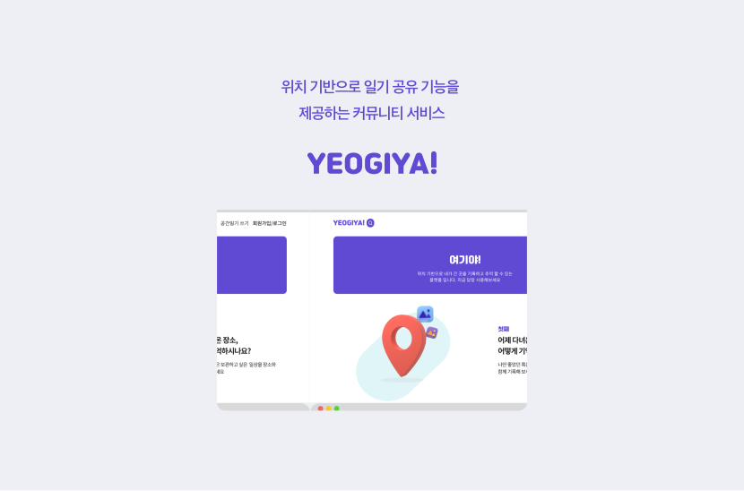
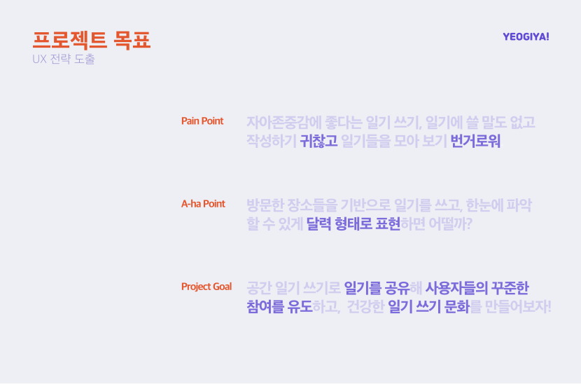
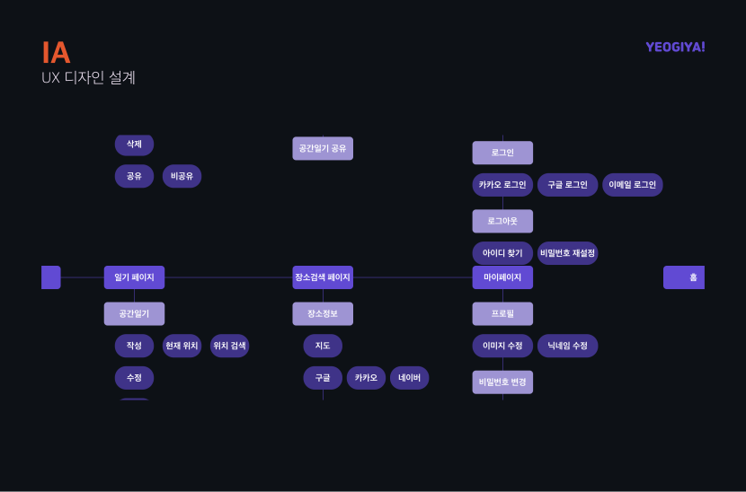
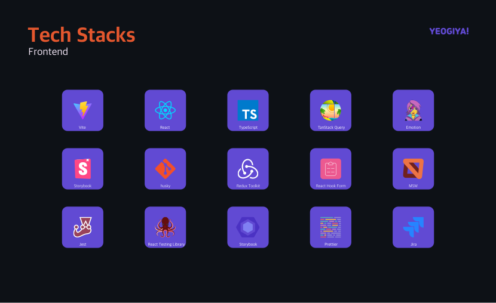
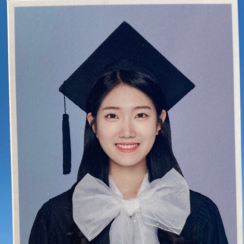
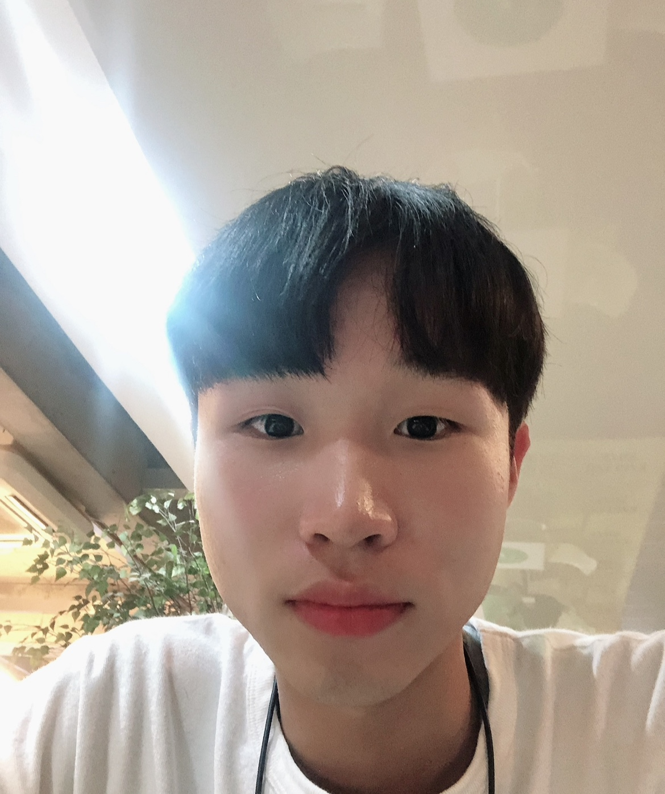

# yeogiya-frontend

## 멤버

<table>
    <tr align=center>
        <td><B>frontend<B></td>
        <td><B>frontend<B></td>
        <td><B>기획<B></td>
        <td><B>디자인<B></td>
    </tr>
    <tr align=center>
        <td></td>
        <td></td>
        <td></td>
        <td></td>
    </tr>
    <tr align=center>
        <td><a href="https://github.com/westhyun">@westhyun</a></td>
        <td><a href="https://github.com/parkgadan">@parkgadan</a></td>
        <td><a href="https://www.linkedin.com/in/완선-신-874b71207">신완선</a></td>
        <td><a href="mailto:fcjscho97@gmail.com">조재승</a></td>
    </tr>
</table>