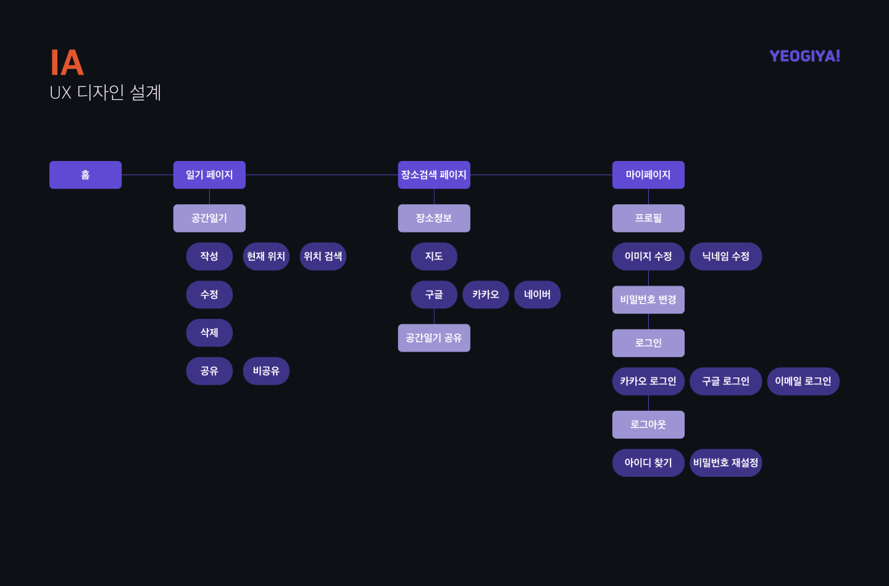
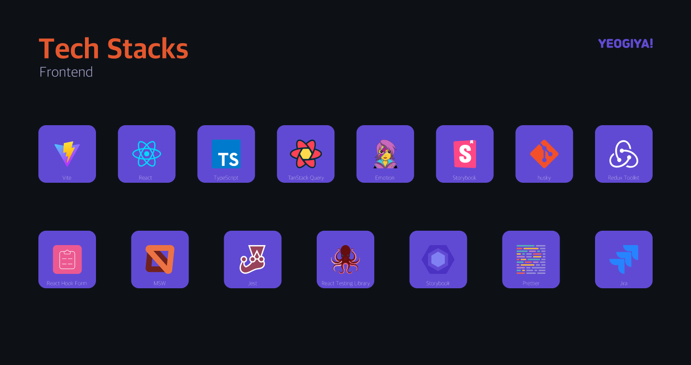

# yeogiya-frontend

## 📌 서비스 개요

> **여기야는** 작성한 일기를 통해 나의 취향을 파악하고 친구들과 추억을 공유하는 기능을 제공하는 커뮤니티 서비스입니다.

- 우울하고 불안함을 호소하는 2030 세대들을 위해 불안감을 떨쳐주고 자신의 솔직한 감정을 살피고 좀 더 행복한 하루를 만들기 위해 일기 쓰기를 제공하는 서비스입니다.

- 일기 쓰기에 그치지 말고 내가 써내려간 하루를 읽어보며 나의 마음을 다스리고 행복한 하루를 만들고, 나아가 나 자신의 취향에 대해 알 수 있는 서비스를 만들고자 했습니다.

- 바쁜 일상 속에서도 내 친구들은 어떤 하루를 살고 있는지 공간 일기 공유를 통해 소통하는 커뮤니티 서비스를 제공합니다.

## 🙋‍♀️ 프로젝트 목표

- 자아존중감에 좋다는 일기 쓰기, 일기에 쓸 말도 없고 작성하기 귀찮은 데다가 일기들을 모아 보기 번거로워.
- 방문한 장소들을 기반으로 일기를 쓰고, 달력 형태로 한눈에 파악할 수 있게 표현하면 어떨까?
- 공간 일기 쓰기를 달력으로 표현해 사용자들이 꾸준한 참여를 유도하고, 자신의 취향을 파악하고 공유하면서 건강한 일기 쓰기 문화를 만들어보자!

## 👩‍💻 Tech Stacks

- ReactTypeScript
- emotion
- react-query
- react-hook-form
- redux-toolkit
- react-calendar
- Storybook
- MSW
- jest
- React Testing Library
- eslint
- pnpm
- vite
- husky
- Git
- GitHub

## 멤버

|                                              frontend                                              |                                              frontend                                               |
| :------------------------------------------------------------------------------------------------: | :-------------------------------------------------------------------------------------------------: |
|  |  |
|                              [@westhyun](https://github.com/westhyun)                              |                             [@parkgadan](https://github.com/parkgadan)                              |
